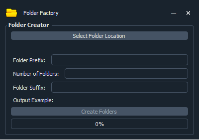

# Folder Factory

Folder factory allows you to create any number of sequential folders with a prefix and a suffix.

You do not have to add a prefix or a suffix if you don't want to.

It will show you an output example of what one of the folder(s) will look like before commiting to 'Create Folders'

1. Select folder location
2. Determine number of folder(s)
3. Determine prefix and suffix
4. Check output example to make sure it satisfies
5. Click 'Create Folders'
6. Done
